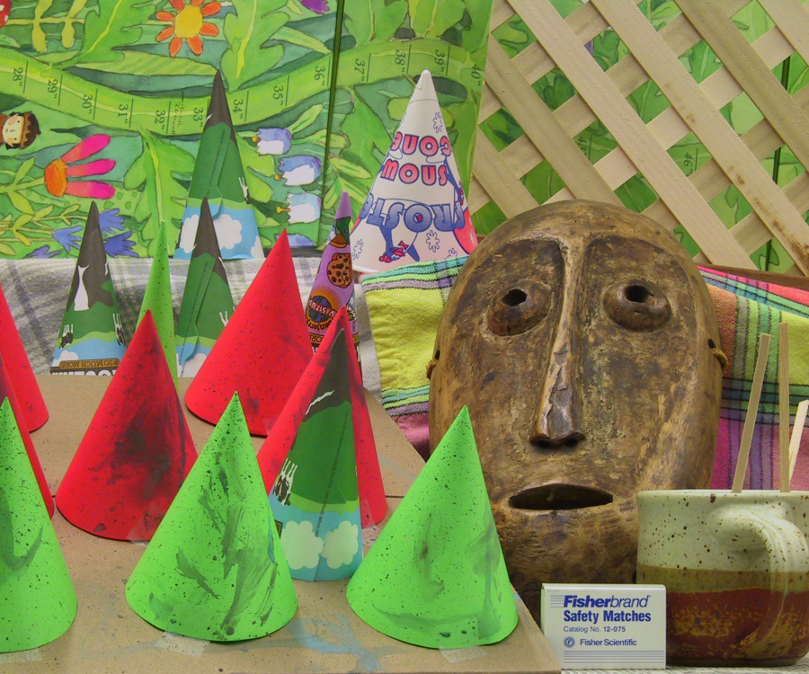
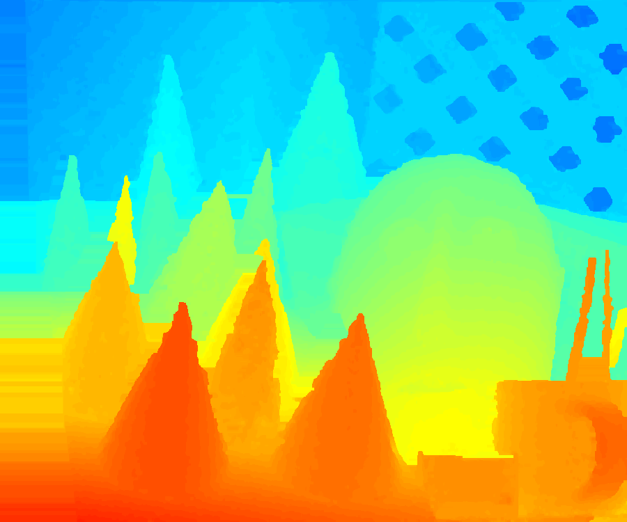
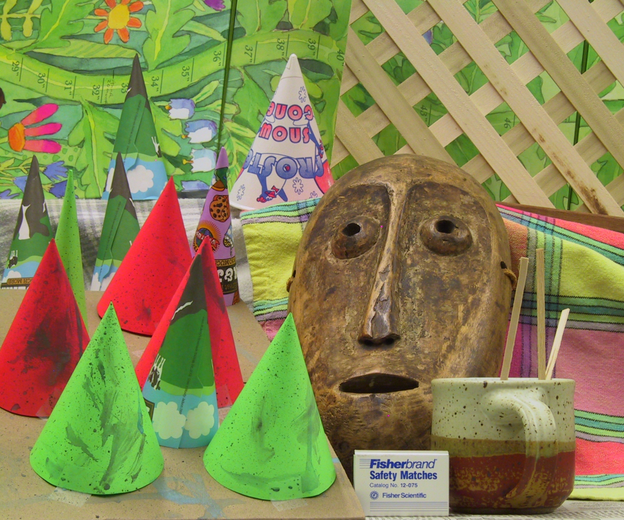
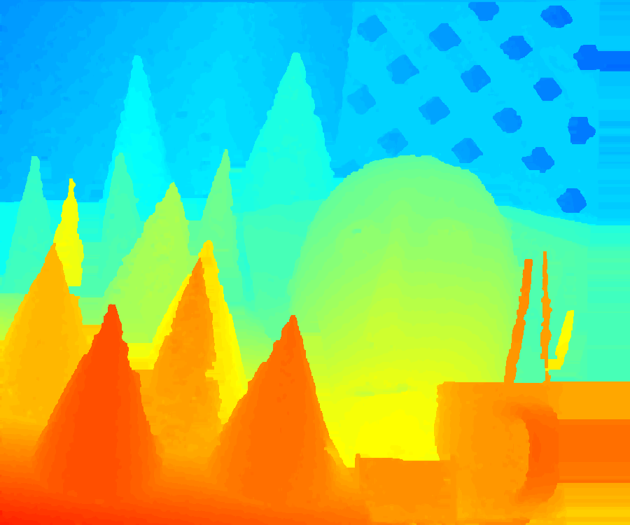

# JBF-Stereo
***JBF-Stereo*** is an implementation for disparity refinement by using joint bilateral filtering (JBF).
The refinement filter consists of joint bilateral filtering and joint nearest filtering, and both filters are CUDA-based GPU implementation.

## Result of disparity refinement by using Joint Bilateral Filter


## Result of PatchMatch Stereo


see more detail for [PatchMatch](./Python/PM/README.md).

## Result of ELAS (Efficient Large-Scale Stereo Matching)


see more detail for [ELAS](./Python/ELAS/README.md).

## Requirements
***JBF-Stereo*** requires the following libraries:
+ cupy
+ opencv
+ scipy
+ nose (only for testing)
```sh
pip install -r requirement.txt
```

## Usage
```sh
# compute disparity using block matching and apply JBF, PM, ELAS
python Python/stereo_main.py
